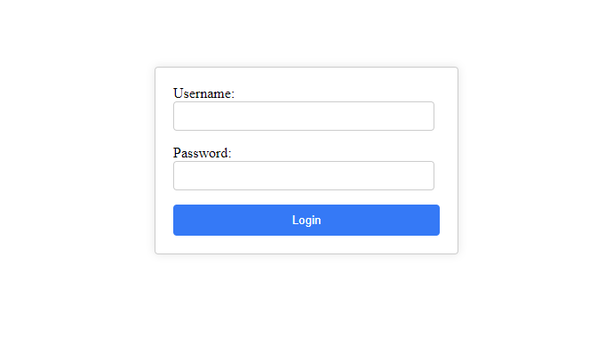
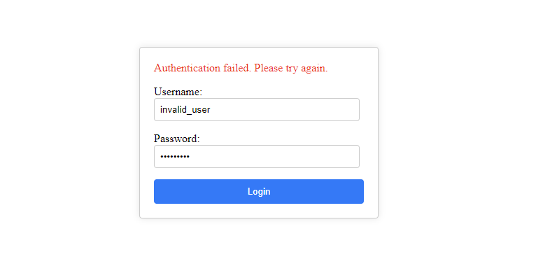
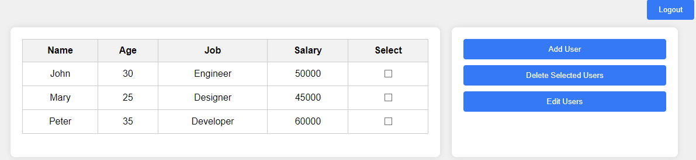
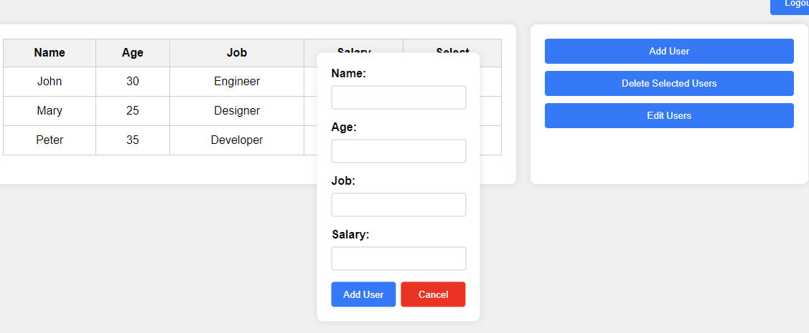
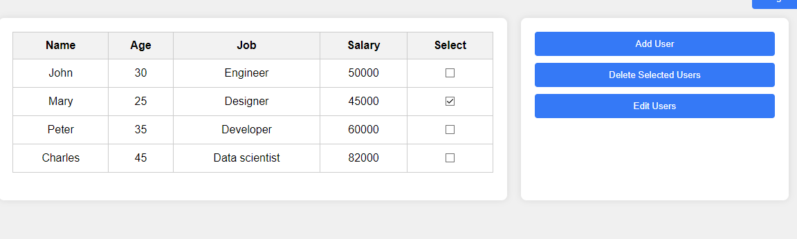
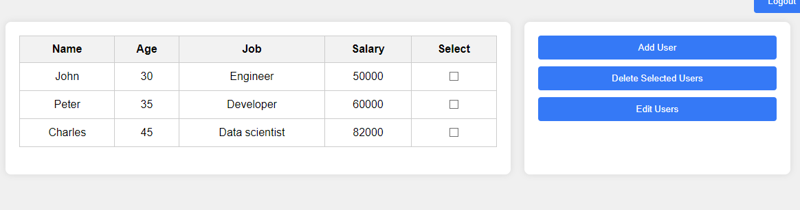
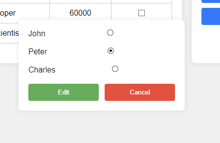
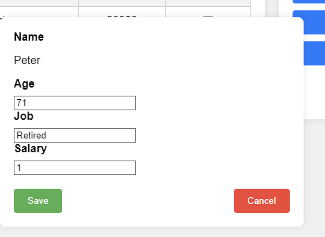
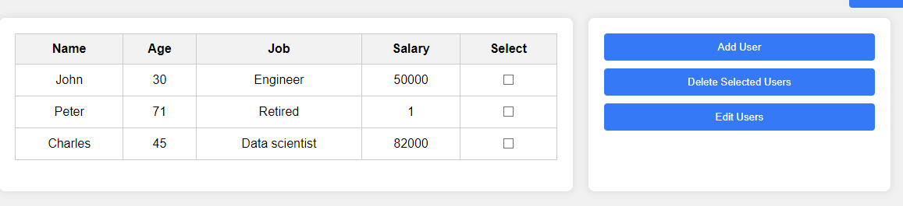

Login Page
---
Insert valid credentials: 

```
- Username: user
- Password: 1234
```



In case of using invalid credentials a notification appears.



Main page
---

There are 3 employees registered by default



Users can be added by clicking "Add User" button. A dialog is displayed an the user inserts the data. Press "Add User" to register a new employee or "Cancel" to close the window.



Employees can be removed by clicking on the checkboxes and then clicking the button "Download Selected Users". The table will reload.





Employee data can be modified by clicking "Edit Users" button. Then the user selects the employee and clicks "Edit" button.







The user can logout clicking the "Logout" button placed at the top right corner.

Session closes automatically after 10 minutes.
